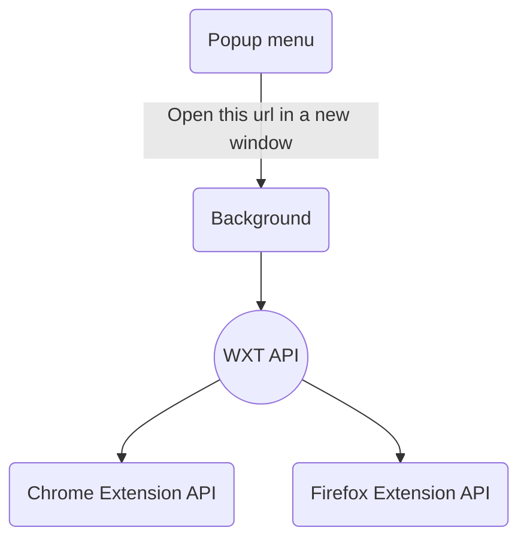

# English Pocket

[](https://ko-fi.com/up9t99)

## Flowchart



## Directory Structure

- **entrypoints/popup**: The content when you click the extension menu in the browser. 
- **entrypoints/content**: The popup menu that you see on the web page.
- **background**: To access the WebExtension API using WXT, such as creating a new window.


## How to build

```bash
# chromium
npm run build 

# firefox
npm run build:firefox
```

You will see the output in the `dist/` directory.
